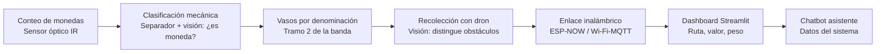
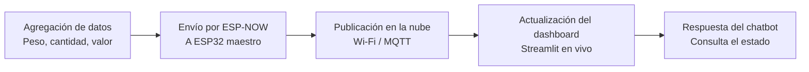

# Sistema logístico de monedas inteligentes

Sistema desarrollado con ESP32 que integra un contador de monedas, un separador mecánico que las clasifica por denominación en vasos independientes, y un dron que recoge esos vasos y los lleva hasta la meta esquivando tres obstáculos. El sistema se comunica de forma inalámbrica con un aplicativo web en Streamlit, donde se visualiza en un dashboard la ruta, el valor de las monedas procesadas, el peso y la cantidad. Un chatbot asistente expone los datos del sistema. Como elemento diferencial, el sistema incorpora visión computacional en dos puntos del proceso: en la clasificación, para distinguir si un objeto es o no una moneda, y en el vuelo del dron, para distinguir los tres obstáculos reales de otros elementos del entorno.

## Arquitectura del sistema



## Proceso físico: de la moneda a la meta

```mermaid
flowchart LR
    P1["Detección y conteo<br/>Sensor óptico IR"] --> P2["Separador mecánico<br/>Canales por denominación"]
    P2 --> P3["Visión computacional<br/>¿Es una moneda?"]
    P3 --> P4["Cae en su vaso<br/>Uno por denominación"]
    P4 --> P5["Vaso viaja por tramo 2<br/>Hasta el punto de recogida"]
    P5 --> P6["Dron recoge el vaso<br/>Lo lleva enganchado"]
    P6 --> P7["Visión computacional<br/>Distingue obstáculos reales"]
    P7 --> P8["Esquive de obstáculos<br/>Campo potencial"]
    P8 --> P9["Llegada a la meta<br/>Entrega el vaso"]
```



## Proceso de datos: de la ESP32 al chatbot



## Selección y justificación de materiales

| Módulo | Componente | Opciones consideradas | Selección | Justificación |
|---|---|---|---|---|
| Conteo de monedas | Sensor de conteo | Sensor óptico IR (par emisor-receptor), sensor inductivo | Sensor óptico IR | Bajo costo, fácil de acondicionar con la ESP32 y tiempo de respuesta adecuado para el paso de las monedas |
| Conteo de monedas | Clasificación por denominación | Separador mecánico por tamaño, sensor óptico de diámetro | Separador mecánico por tamaño | Ranuras de distinto ancho separan las monedas por diámetro mientras caen; cada canal usa el mismo sensor óptico IR de conteo, sin electrónica analógica adicional ni calibración |
| Clasificación | Visión computacional (moneda o no) | Sensor óptico simple, cámara + OpenCV (detección de contornos/círculos) | Cámara + OpenCV (Hough Circle Transform / contornos) | Distingue la forma circular característica de una moneda de otros objetos sin necesitar un dataset de entrenamiento; suficientemente ligero para correr en tiempo real junto al separador |
| Transporte y embalaje | Actuador de compuerta/tolva | Motor paso a paso, servomotor | Motor paso a paso | Control preciso de posición para dosificar las monedas hacia el vaso sin necesidad de retroalimentación de posición |
| Recolección con dron | Propulsión y sustentación | Motores brushless + ESC, motores DC con hélice | Motores brushless + ESC (x4, configuración en X) | Necesarios para generar sustentación y controlar el vuelo; es la opción estándar para un dron ligero con buena relación potencia/peso |
| Recolección con dron | Detección de proximidad | Sensores ultrasónicos HC-SR04, sensores IR de distancia | Sensores ultrasónicos HC-SR04 (x3) | Mayor rango y precisión de distancia que el IR; refuerzan a la cámara para no colisionar con los tres obstáculos del recorrido |
| Recolección con dron | Visión computacional (obstáculos) | ESP32-CAM sola, cámara + CNN ligera procesada en PC/Raspberry Pi | Cámara + CNN ligera (tipo YOLOv8-nano) fuera de la ESP32 | Debe distinguir los 3 obstáculos reales de otros objetos del entorno en tiempo real durante el vuelo; una CNN ligera generaliza mejor que solo contornos, y se procesa en un equipo externo por las limitaciones de cómputo de la ESP32-CAM |
| Comunicación | Enlace entre módulos ESP32 | Bluetooth, ESP-NOW, Wi-Fi directo | ESP-NOW | Baja latencia y bajo consumo entre varios ESP32 sin necesidad de un router intermedio |
| Comunicación | Enlace hacia el dashboard | Wi-Fi + HTTP (polling), Wi-Fi + MQTT | Wi-Fi + MQTT | Modelo publicador/suscriptor ideal para actualizaciones en tiempo real hacia Streamlit sin polling constante |
| Dashboard | Framework de visualización | Streamlit, Flask + Chart.js, Node-RED | Streamlit | Requisito del proyecto; rápido de prototipar con gráficos en tiempo real en Python |
| Chatbot | Motor del chatbot | Reglas simples, API de LLM | API de LLM con el estado actual como contexto | Permite respuestas más naturales y flexibles sobre las variables del sistema |

> Los diagramas usan sintaxis Mermaid, por lo que se renderizan automáticamente en la vista del README de GitHub.

## Visión computacional: los dos puntos de detección

Tras la revisión con el profesor, se definió que la visión computacional debe aplicarse en dos momentos distintos del proceso, cada uno con una necesidad diferente:

1. **En la clasificación** (fija, sobre el separador): solo necesita confirmar si el objeto que pasa es una moneda o no, para no contar ni desviar elementos ajenos. Al ser una forma simple (círculo) y una cámara fija, basta con **OpenCV** usando detección de contornos o la transformada de Hough para círculos — no requiere una red neuronal entrenada.
2. **En el vuelo del dron**: debe distinguir los 3 obstáculos reales de cualquier otro objeto del entorno, con la cámara en movimiento y en tiempo real. Para esto se propone una **CNN ligera (por ejemplo YOLOv8-nano)**, procesada fuera de la ESP32 (en un PC o Raspberry Pi a bordo o en tierra, enviando los comandos de vuelo por radio), ya que la ESP32-CAM sola no tiene el cómputo necesario para correr una red así en tiempo real. Este es el mismo enfoque de visión + CNN, adaptado aquí a la detección de obstáculos en vuelo.

## Simulación en PyBullet

Como primer avance funcional del proyecto, se construyó una simulación 3D en PyBullet que reproduce el flujo físico completo del sistema corregido: transporte, clasificación por denominación en vasos, transporte de esos vasos y recolección con dron esquivando obstáculos. Está compuesta por tres archivos que trabajan juntos:

- `fabrica_monedas.urdf`: la escena fija (decorado). Modela en 3D una única banda transportadora continua, el separador mecánico de 3 canales que clasifica por denominación. Todas sus piezas están unidas por articulaciones de tipo `fixed`, es decir, no se mueven por sí solas; es el escenario sobre el que ocurre la simulación. (En versiones anteriores incluía una máquina de embalaje, dos brazos robóticos, vasos decorativos fijos y un carrito estático que no cumplían ninguna función real dentro del proceso; se retiraron para que la escena contenga solo lo que efectivamente se usa.)
- `dron_recolector.urdf`: el único cuerpo que sí se puede desplazar. Es un dron de diseño simple — cuerpo central con 4 brazos en X y su hélice en cada punta — sin partes móviles complejas, ya que no necesita ruedas ni motores de tracción: se mueve directamente en el aire.
- `simulate_monedas.py`: el script que carga los dos modelos anteriores, anima las monedas y los vasos, y controla el vuelo del dron. Es el que efectivamente "corre" la simulación.

### Qué hace el script paso a paso

1. **Carga la escena y el dron**: se conecta a PyBullet en modo gráfico (`p.connect(p.GUI)`), carga el suelo, la fábrica (fija) y el dron (móvil), y ubica cada uno en su posición inicial, esperando en el punto de recogida.
2. **Genera las monedas**: crea 6 cilindros de colores (sin física real, solo geometría visual) representando 3 denominaciones — $500 dorada, $200 plateada y $100 cobre —, repartidas por turnos.
3. **Anima el transporte por la banda**: cada moneda recorre en línea recta el tramo inicial de la banda a una velocidad controlada, saliendo una tras otra con un intervalo de tiempo entre ellas. Este es el punto donde, en el sistema real, la visión por OpenCV confirmaría que el objeto es una moneda antes de dejarlo continuar.
4. **Clasifica por denominación (separador mecánico)**: al llegar al final del primer tramo, cada moneda se desvía por el canal inclinado que le corresponde según su denominación y cae dentro de su vaso, que está visible y quieto en ese punto esperándola. Ahí se actualiza un contador de conteo, peso y valor por denominación, que se imprime en la consola como si fuera el dato que enviaría la ESP32 al dashboard.
5. **El vaso viaja por el tramo 2**: en cuanto un vaso recibe todas sus monedas, se despega de su puesto y se desliza visiblemente sobre la banda ancha hasta el punto de recogida, al final del recorrido.
6. **El dron recoge el vaso y vuela a la meta**: el dron espera en el punto de recogida; en cuanto el vaso llega, lo engancha (a partir de ahí el vaso viaja pegado al dron, visible todo el trayecto), atraviesa un corredor con 3 obstáculos fijos y lo entrega en la meta correspondiente a esa denominación. Luego regresa por la siguiente.
7. **Navegación y esquive de obstáculos**: el dron se mueve con un algoritmo de campo potencial simple: una fuerza lo atrae hacia su destino y otra lo repele de cada obstáculo cuando se acerca demasiado, combinando ambas para decidir hacia dónde avanzar en cada instante — el equivalente simulado de lo que en el sistema real haría la visión computacional al distinguir los obstáculos.

### Cómo ejecutarla

```
pip install pybullet
python simulate_monedas.py
```

Los tres archivos (`fabrica_monedas.urdf`, `dron_recolector.urdf` y `simulate_monedas.py`) deben estar en la misma carpeta.

## Video de la simulación

[](https://youtu.be/3Gm8v5f8uF4)

## Dashboard web y comunicación inalámbrica 

Como primer avance de la aplicación web y su comunicación inalámbrica con la ESP32, se construyó un dashboard en Streamlit que se conecta por Wi-Fi (protocolo MQTT) a un tema donde se publican las métricas del sistema. Como todavía no existe el ESP32 físico, se construyó un script que simula ese rol, publicando datos de ejemplo al mismo canal que el dashboard real usaría. Son dos archivos:

- `simulador_esp32.py`: hace las veces del ESP32 maestro. Genera eventos de "moneda clasificada" (denominación, peso, valor) y los publica por MQTT hacia un broker público, exactamente como lo haría la ESP32 real una vez el separador mecánico esté construido.
- `dashboard_streamlit.py`: la aplicación web. Se suscribe al mismo tema MQTT y muestra en vivo el conteo, peso y valor totales, además del desglose por denominación con una gráfica de barras, sin necesidad de recargar la página.

### Qué hace cada script paso a paso

**`simulador_esp32.py`:**
1. Se conecta al broker MQTT público (`broker.hivemq.com`), que actúa como intermediario de mensajes por Wi-Fi.
2. Cada pocos segundos, elige al azar una denominación ($500, $200 o $100) y actualiza sus totales acumulados (cantidad, peso, valor).
3. Publica esos totales como un mensaje JSON en un tema (`topic`) específico del proyecto, imprimiendo en consola cada envío para verificar que la comunicación esté funcionando.

**`dashboard_streamlit.py`:**
1. Al iniciar, se suscribe al mismo tema MQTT donde publica el simulador (o, más adelante, la ESP32 real).
2. Cada vez que llega un mensaje nuevo, lo guarda en memoria mediante una función de escucha (`on_message`) que corre en segundo plano.
3. La interfaz se refresca constantemente mostrando: tarjetas con el total de monedas, peso y valor acumulado; un desglose por denominación; y una gráfica de barras comparando la cantidad de monedas por denominación.

### Cómo ejecutarlo

```
pip install streamlit paho-mqtt pandas
```

En dos terminales distintas, dentro de la misma carpeta del proyecto:

```
python simulador_esp32.py
```
```
streamlit run dashboard_streamlit.py
```

> Se usa un broker MQTT público (sin autenticación) únicamente para efectos de esta demostración. En la versión final del proyecto, este enlace se reemplazaría por un broker propio o con autenticación, y `simulador_esp32.py` se sustituiría por el firmware real de la ESP32 publicando al mismo tema.

## Video dashboard web

[](https://youtu.be/Kce6V6-4xqI)

# Autores

Lina María Moreno Ospina y Bryan Andrey Martinez Montaño

Ingeniería Mecatrónica

Universidad Militar Nueva Granada
