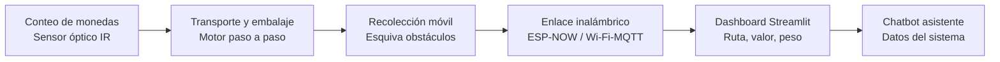
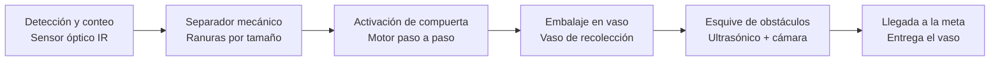
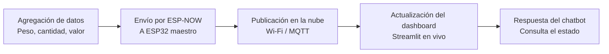

# Sistema logístico de monedas inteligentes
 
Sistema desarrollado con ESP32 que integra un contador de monedas, un módulo de transporte y embalaje, y un sistema de recolección móvil que sigue una trayectoria con tres obstáculos hasta llegar a la meta. El sistema se comunica de forma inalámbrica con un aplicativo web en Streamlit, donde se visualiza en un dashboard la ruta, el valor de las monedas procesadas, el peso y la cantidad. Un chatbot asistente expone los datos del sistema. Como elemento diferencial, el sistema incorpora visión computacional para distinguir los obstáculos del recorrido de elementos ajenos a las monedas.
 
## Arquitectura del sistema
 

 
## Proceso físico: de la moneda a la meta
 

 
## Proceso de datos: de la ESP32 al chatbot
 

 
## Selección y justificación de materiales
 
| Módulo | Componente | Opciones consideradas | Selección | Justificación |
|---|---|---|---|---|
| Conteo de monedas | Sensor de conteo | Sensor óptico IR (par emisor-receptor), sensor inductivo | Sensor óptico IR | Bajo costo, fácil de acondicionar con la ESP32 y tiempo de respuesta adecuado para el paso de las monedas |
| Conteo de monedas | Clasificación por denominación | Separador mecánico por tamaño, sensor óptico de diámetro | Separador mecánico por tamaño | Ranuras de distinto ancho separan las monedas por diámetro mientras caen; cada canal usa el mismo sensor óptico IR de conteo, sin electrónica analógica adicional ni calibración |
| Transporte y embalaje | Actuador de compuerta/tolva | Motor paso a paso, servomotor | Motor paso a paso | Control preciso de posición para dosificar las monedas hacia el vaso sin necesidad de retroalimentación de posición |
| Recolección móvil | Tracción | Motores DC + driver puente H, motores paso a paso | Motores DC + driver TB6612/L298N | Mayor velocidad y simplicidad de control diferencial para el recorrido, con menor consumo que un par de steppers |
| Recolección móvil | Detección de obstáculos | Sensores ultrasónicos HC-SR04, sensores IR de distancia | Sensores ultrasónicos HC-SR04 (x3) | Mayor rango y precisión de distancia que el IR, adecuado para detectar los tres obstáculos del recorrido |
| Recolección móvil | Visión computacional | ESP32-CAM, cámara USB + procesador externo | ESP32-CAM | Se integra directamente al ecosistema ESP32 sin necesidad de un procesador adicional, suficiente para diferenciar obstáculos de elementos ajenos |
| Comunicación | Enlace entre módulos ESP32 | Bluetooth, ESP-NOW, Wi-Fi directo | ESP-NOW | Baja latencia y bajo consumo entre varios ESP32 sin necesidad de un router intermedio |
| Comunicación | Enlace hacia el dashboard | Wi-Fi + HTTP (polling), Wi-Fi + MQTT | Wi-Fi + MQTT | Modelo publicador/suscriptor ideal para actualizaciones en tiempo real hacia Streamlit sin polling constante |
| Dashboard | Framework de visualización | Streamlit, Flask + Chart.js, Node-RED | Streamlit | Requisito del proyecto; rápido de prototipar con gráficos en tiempo real en Python |
| Chatbot | Motor del chatbot | Reglas simples, API de LLM | API de LLM con el estado actual como contexto | Permite respuestas más naturales y flexibles sobre las variables del sistema |
 
 
