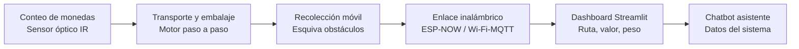
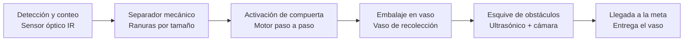
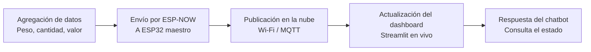

# Sistema logístico de monedas inteligentes
 
Sistema desarrollado con ESP32 que integra un contador de monedas, un módulo de transporte y embalaje, y un sistema de recolección móvil que sigue una trayectoria con tres obstáculos hasta llegar a la meta. El sistema se comunica de forma inalámbrica con un aplicativo web en Streamlit, donde se visualiza en un dashboard la ruta, el valor de las monedas procesadas, el peso y la cantidad. Un chatbot asistente expone los datos del sistema. Como elemento diferencial, el sistema incorpora visión computacional para distinguir los obstáculos del recorrido de elementos ajenos a las monedas.
 
## Arquitectura del sistema
 

 
## Proceso físico: de la moneda a la meta
 

 
## Proceso de datos: de la ESP32 al chatbot
 

 
## Selección y justificación de materiales
 
| Módulo | Componente | Opciones consideradas | Selección | Justificación |
|---|---|---|---|---|
| Conteo de monedas | Sensor de conteo | Sensor óptico IR (par emisor-receptor), sensor inductivo | Sensor óptico IR | Bajo costo, fácil de acondicionar con la ESP32 y tiempo de respuesta adecuado para el paso de las monedas |
| Conteo de monedas | Clasificación por denominación | Separador mecánico por tamaño, sensor óptico de diámetro | Separador mecánico por tamaño | Ranuras de distinto ancho separan las monedas por diámetro mientras caen; cada canal usa el mismo sensor óptico IR de conteo, sin electrónica analógica adicional ni calibración |
| Transporte y embalaje | Actuador de compuerta/tolva | Motor paso a paso, servomotor | Motor paso a paso | Control preciso de posición para dosificar las monedas hacia el vaso sin necesidad de retroalimentación de posición |
| Recolección móvil | Tracción | Motores DC + driver puente H, motores paso a paso | Motores DC + driver TB6612/L298N | Mayor velocidad y simplicidad de control diferencial para el recorrido, con menor consumo que un par de steppers |
| Recolección móvil | Detección de obstáculos | Sensores ultrasónicos HC-SR04, sensores IR de distancia | Sensores ultrasónicos HC-SR04 (x3) | Mayor rango y precisión de distancia que el IR, adecuado para detectar los tres obstáculos del recorrido |
| Recolección móvil | Visión computacional | ESP32-CAM, cámara USB + procesador externo | ESP32-CAM | Se integra directamente al ecosistema ESP32 sin necesidad de un procesador adicional, suficiente para diferenciar obstáculos de elementos ajenos |
| Comunicación | Enlace entre módulos ESP32 | Bluetooth, ESP-NOW, Wi-Fi directo | ESP-NOW | Baja latencia y bajo consumo entre varios ESP32 sin necesidad de un router intermedio |
| Comunicación | Enlace hacia el dashboard | Wi-Fi + HTTP (polling), Wi-Fi + MQTT | Wi-Fi + MQTT | Modelo publicador/suscriptor ideal para actualizaciones en tiempo real hacia Streamlit sin polling constante |
| Dashboard | Framework de visualización | Streamlit, Flask + Chart.js, Node-RED | Streamlit | Requisito del proyecto; rápido de prototipar con gráficos en tiempo real en Python |
| Chatbot | Motor del chatbot | Reglas simples, API de LLM | API de LLM con el estado actual como contexto | Permite respuestas más naturales y flexibles sobre las variables del sistema |


 # Simulación en Pybullet de sistema mecanico
Como primer avance funcional del proyecto, se construyó una simulación 3D en PyBullet que reproduce el flujo completo del sistema: transporte, clasificación por denominación y recolección esquivando obstáculos. Está compuesta por tres archivos que trabajan juntos:
 
- `fabrica_monedas.urdf`: la escena fija (decorado). Modela en 3D la máquina de embalaje, la banda transportadora, los brazos robóticos y el carro recolector. Todas sus piezas están unidas por articulaciones de tipo `fixed`, es decir, no se mueven por sí solas; es el escenario sobre el que ocurre la simulación.
- `robot_recolector_movil.urdf`: el único cuerpo que sí se puede desplazar. Es un carrito simple (chasis + 2 ruedas motrices + 1 rueda loca de apoyo) con articulaciones `continuous` en las ruedas, lo que le permite avanzar por el escenario.
- `simulate_monedas.py`: el script que carga los dos modelos anteriores, anima las monedas y controla el movimiento del carrito. Es el que efectivamente "corre" la simulación.
### Qué hace el script paso a paso
 
1. **Carga la escena y el robot**: se conecta a PyBullet en modo gráfico (`p.connect(p.GUI)`), carga el suelo, la fábrica (fija) y el carrito recolector (móvil), y ubica cada uno en su posición inicial.
2. **Genera las monedas**: crea 6 cilindros de colores (sin física real, solo geometría visual) representando 3 denominaciones — $500 dorada, $200 plateada y $100 cobre —, repartidas por turnos.
3. **Anima el transporte por la banda**: cada moneda recorre en línea recta el trayecto de la banda a una velocidad controlada, saliendo una tras otra con un intervalo de tiempo entre ellas.
4. **Clasifica por denominación**: al llegar al final de la banda, cada moneda se desvía hacia uno de 3 canales de color (uno por denominación) — el equivalente simulado del separador mecánico por tamaño descrito en la arquitectura del proyecto. En este momento se actualiza un contador de conteo, peso y valor por denominación, que se imprime en la consola como si fuera el dato que enviaría la ESP32 al dashboard.
5. **Recorrido del carrito recolector**: una vez clasificadas las 6 monedas, un único carrito hace tres vueltas (una por denominación): recoge las monedas de un canal (que "desaparecen" simulando que fueron cargadas), atraviesa un corredor con 3 obstáculos fijos, y las entrega en la meta correspondiente a esa denominación. Luego regresa por la siguiente.
6. **Navegación y esquive de obstáculos**: el carrito se mueve con un algoritmo de campo potencial simple: una fuerza lo atrae hacia su destino y otra lo repele de cada obstáculo cuando se acerca demasiado, combinando ambas para decidir hacia dónde avanzar en cada instante.
### Cómo ejecutarla
 
```
pip install pybullet
python simulate_monedas.py
```
 
Los tres archivos (`fabrica_monedas.urdf`, `robot_recolector_movil.urdf` y `simulate_monedas.py`) deben estar en la misma carpeta.

# Video de la simulación

[](https://youtu.be/IRvJV4W_veE)

## Dashboard web y comunicación inalámbrica 
 
Como primer avance de la aplicación web y su comunicación inalámbrica con la ESP32, se construyó un dashboard en Streamlit que se conecta por Wi-Fi (protocolo MQTT) a un tema donde se publican las métricas del sistema. Como todavía no existe el ESP32 físico, se construyó un script que simula ese rol, publicando datos de ejemplo al mismo canal que el dashboard real usaría. Son dos archivos:
 
- `simulador_esp32.py`: hace las veces del ESP32 maestro. Genera eventos de "moneda clasificada" (denominación, peso, valor) y los publica por MQTT hacia un broker público, exactamente como lo haría la ESP32 real una vez el separador mecánico esté construido.
- `dashboard_streamlit.py`: la aplicación web. Se suscribe al mismo tema MQTT y muestra en vivo el conteo, peso y valor totales, además del desglose por denominación con una gráfica de barras, sin necesidad de recargar la página.
### Qué hace cada script paso a paso
 
**`simulador_esp32.py`:**
1. Se conecta al broker MQTT público (`broker.hivemq.com`), que actúa como intermediario de mensajes por Wi-Fi.
2. Cada pocos segundos, elige al azar una denominación ($500, $200 o $100) y actualiza sus totales acumulados (cantidad, peso, valor).
3. Publica esos totales como un mensaje JSON en un tema (`topic`) específico del proyecto, imprimiendo en consola cada envío para verificar que la comunicación esté funcionando.
**`dashboard_streamlit.py`:**
1. Al iniciar, se suscribe al mismo tema MQTT donde publica el simulador (o, más adelante, la ESP32 real).
2. Cada vez que llega un mensaje nuevo, lo guarda en memoria mediante una función de escucha (`on_message`) que corre en segundo plano.
3. La interfaz se refresca constantemente mostrando: tarjetas con el total de monedas, peso y valor acumulado; un desglose por denominación; y una gráfica de barras comparando la cantidad de monedas por denominación.
### Cómo ejecutarlo
 
```
pip install streamlit paho-mqtt pandas
```
 
En dos terminales distintas, dentro de la misma carpeta del proyecto:
 
```
python simulador_esp32.py
```
```
streamlit run dashboard_streamlit.py
```
 
> Se usa un broker MQTT público (sin autenticación) únicamente para efectos de esta demostración. En la versión final del proyecto, este enlace se reemplazaría por un broker propio o con autenticación, y `simulador_esp32.py` se sustituiría por el firmware real de la ESP32 publicando al mismo tema.

# Video dashboard web 

[](https://youtu.be/Kce6V6-4xqI)
 
# Autores 

Lina María Moreno Ospina y Bryan Andrey Martinez Montaño

Ingeniería Mecatrónica 

Universidad Militar Nueva Granada
